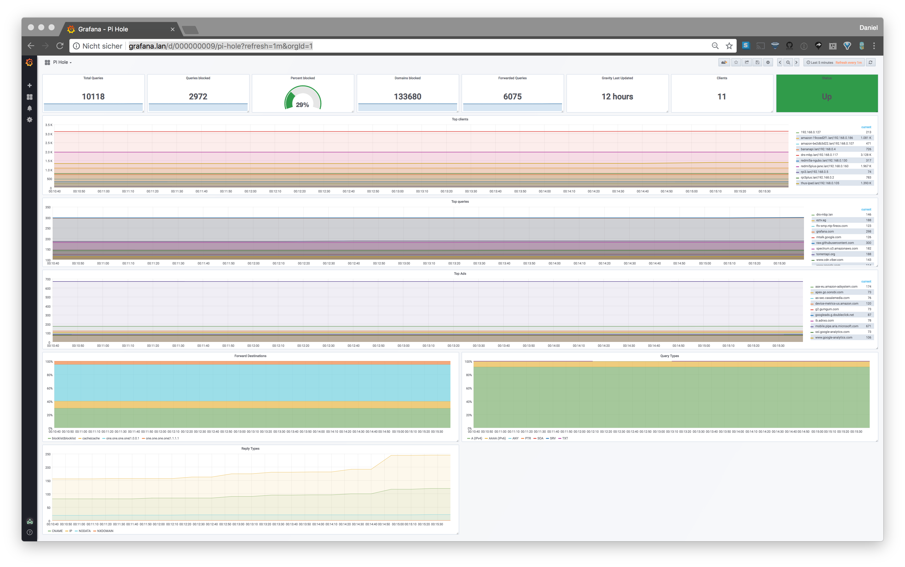

# pihole_exporter.py

A prometheus exporter for PiHole written in Python 3.

See [grafana_dashboard.json](grafana_dashboard.json)

# Content
- [pihole_exporter.py](#piholeexporterpy)
- [Content](#content)
- [Available metrics](#available-metrics)
	- [Metrics Example](#metrics-example)
- [Setup](#setup)
	- [pip](#pip)
	- [manual](#manual)
	- [Docker](#docker)
		- [docker-hub](#docker-hub)
		- [manual](#manual)
- [Usage](#usage)
	- [Usage Example](#usage-example)
	- [Authentication](#authentication)
- [Prometheus config](#prometheus-config)

# Available metrics
* Queries forwarded (24h)
* Domains being blocked
* Ads percentage today
* Ads blocked today
* DNS queries today
* Total clients
* Unique clients
* Queries cached
* Unique Domains
* Top Queries
* Top Ads
* Top clients
* Forward destinations
* Query type
* Reply type
* DNS queries by host

## Metrics Example
Some metrics have been redacted.

	pihole_exporter_version 0.1
	pihole_domains_being_blocked 573713
	pihole_dns_queries_today 13961
	pihole_ads_blocked_today 3443
	pihole_ads_percentage_today 24.661556
	pihole_unique_domains 983
	pihole_queries_forwarded 4346
	pihole_queries_cached 3288
	pihole_clients_ever_seen 9
	pihole_unique_clients 5
	pihole_dns_queries_all_types 13974
	pihole_reply_nodata 34
	pihole_reply_nxdomain 0
	pihole_reply_cname 37
	pihole_reply_ip 88
	pihole_status 1
	pihole_gravity_last_updated 1533820315
	pihole_top_queries{domain="raw.githubusercontent.com"} 321
	pihole_top_queries{domain="grafana.com"} 292
	pihole_top_queries{domain="connect.rom.miui.com"} 165
	pihole_top_queries{domain="spectrum.s3.amazonaws.com"} 145
	pihole_top_queries{domain="mtalk.google.com"} 124
	pihole_top_queries{domain="www.cdn.viber.com"} 112
	pihole_top_queries{domain="redirector.googlevideo.com"} 112
	pihole_top_queries{domain="ntp-g7g.amazon.com"} 98
	pihole_top_queries{domain="www.google.com"} 72
	pihole_top_ads{domain="mobile.pipe.aria.microsoft.com"} 872
	pihole_top_ads{domain="www.googleadservices.com"} 169
	pihole_top_ads{domain="www.google-analytics.com"} 147
	pihole_top_ads{domain="s.youtube.com"} 133
	pihole_top_ads{domain="data.mistat.intl.xiaomi.com"} 114
	pihole_top_ads{domain="api.brs.intl.miui.com"} 89
	pihole_top_ads{domain="device-metrics-us.amazon.com"} 88
	pihole_top_ads{domain="adservice.google.com"} 75
	pihole_top_ads{domain="aax-eu.amazon-adsystem.com"} 73
	pihole_top_ads{domain="sb.scorecardresearch.com"} 71
	pihole_top_sources{client="192.168.1.10"} 2833
	pihole_top_sources{client="192.168.1.2"} 2799
	pihole_top_sources{client="192.168.1.1"} 1045
	pihole_top_sources{client="192.168.1.7"} 332
	pihole_top_sources{client="192.168.1.5"} 277
	pihole_forward_destinations{resolver="blocklist|blocklist"} 31.08
	pihole_forward_destinations{resolver="cache|cache"} 29.68
	pihole_forward_destinations{resolver="1dot1dot1dot1.cloudflare-dns.com|1.1.1.1"} 39.23
	pihole_query_type{type="A (IPv4)"} 76.53
	pihole_query_type{type="AAAA (IPv6)"} 23.38
	pihole_query_type{type="ANY"} 0
	pihole_query_type{type="SRV"} 0
	pihole_query_type{type="SOA"} 0
	pihole_query_type{type="PTR"} 0.09
	pihole_query_type{type="TXT"} 0

# Setup

## pip
### PyPI

    pip3 install --upgrade pihole_exporter

### github master branch

    pip3 install --upgrade git+https://github.com/dr1s/pihole_exporter.py.git

## manual
    git clone https://github.com/dr1s/pihole_exporter.py.git
    cd pihole_exporter.py
    pip3 install -r requirements.txt
    cd pihole_exporter
    ./pihole_exporter.py

## Docker

### docker-hub
    docker pull dr1s/pihole_exporter
    docker run --net=host -v /etc/pihole:/etc/pihole -t dr1s/pihole_exporter

### manual
    git clone https://github.com/dr1s/pihole_exporter.py.git
    docker build -t dr1s/pihole_exporter .
    docker run -d --net=host -v /etc/pihole:/etc/pihole -t dr1s/pihole_exporter

# Usage
	usage: pihole_exporter.py [-h] [-o PIHOLE] [-p PORT] [-i INTERFACE] [-a AUTH]
	                          [-e]

	pihole_exporter

	optional arguments:
	  -h, --help            show this help message and exit
	  -o PIHOLE, --pihole PIHOLE
	                        pihole adress
	  -p PORT, --port PORT  port pihole_exporter is listening on
	  -i INTERFACE, --interface INTERFACE
	                        interface pihole_exporter will listen on
	  -a AUTH, --auth AUTH  Pihole password hash
	  -e, --extended-metrics
	                        Extended pihole metrics

## Usage Example

    pihole_exporter --pihole pi.hole --interface 0.0.0.0 --port 9311

The previous used arguements are the default options. If nothing needs to be changed, pihole_exporter can be started without arguments.

	pihole_exporter

## Authentication
If pihole_exporter is installed on the same host as pihole and the auth argument is not set, pihole_exporter will try to read the password from setupVars.conf

Otherwise get the hashed password from setupVars.conf:

	$ grep WEBPASSWORD /etc/pihole/setupVars.conf
	WEBPASSWORD=da1a51f575cd740be233d22548ecac1dbcc96ffa297283a6a204f9213a8aca71

Use this hash as the argument for `--auth`

	pihole_exporter --auth da1a51f575cd740be233d22548ecac1dbcc96ffa297283a6a204f9213a8aca71
	docker run -d --net=host -t dr1s/pihole_exporter --pihole pi.hole --auth da1a51f575cd740be233d22548ecac1dbcc96ffa297283a6a204f9213a8aca71

# Prometheus config
    - job_name: 'pihole'
      static_configs:
      - targets: ['pi.hole:9311']
